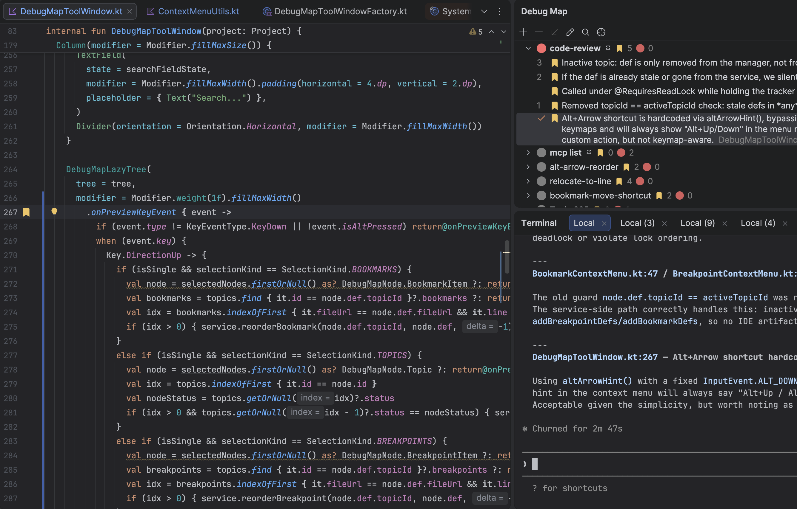
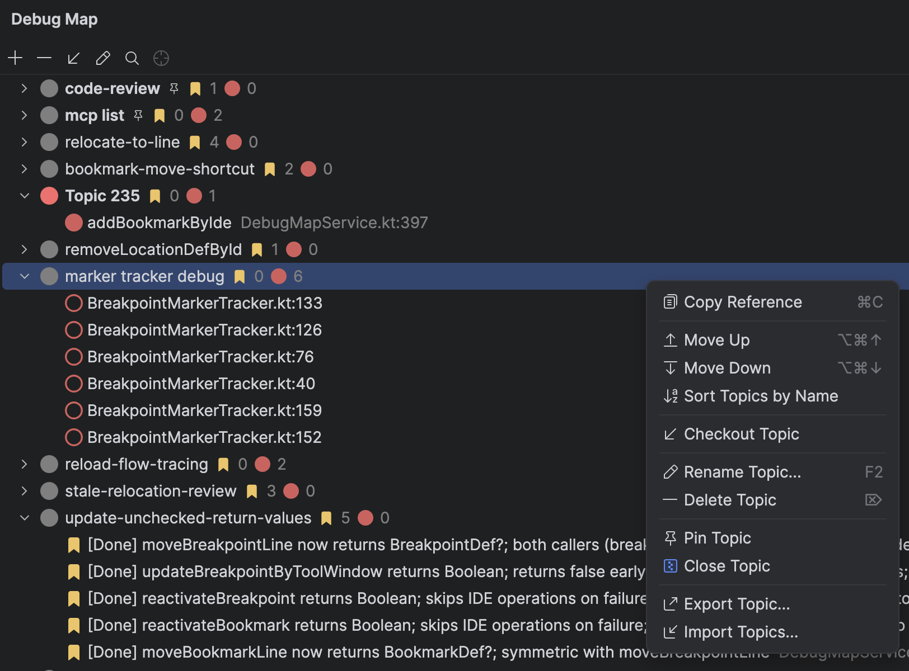

# Debug Map

Manage breakpoints and bookmarks by topics, with AI-powered automatic placement to keep every debug flow organized and persistent.





## Features

- **AI integration** — let AI assistants like Claude automatically place breakpoints and bookmarks at key code points via MCP, helping you trace, review, and persist long call chains without missing a step
- **Topic-based isolation** — activate a topic to show only its breakpoints; inactive topics are persisted in the background without interfering with other debug flows
- **Dedicated management panel** — organize breakpoints and bookmarks into named topics
- **Import / export** — share topics or reuse them across projects

## Setup for AI integration

1. Go to **Settings → Tools → MCP Server** and enable **Enable MCP Server**
2. Use **Auto-Configuration** to connect your AI assistant (e.g. Claude)
3. Go to **Settings → Tools → MCP Server → Exposed Tools** and enable the tools you need — it is recommended to only enable **BookmarkToolset** and **DebugToolset**

## Recommended AI prompts

Add the following to your `CLAUDE.md`, `GEMINI.md`, or equivalent AI configuration file:

```markdown
# Code Review

When reviewing code, use bookmarks only for points that warrant attention:
- Bugs or potential issues found
- Non-obvious design decisions or constraints (things that aren't clear from reading the diff)
- Worthy trade-offs or risks to discuss

# Annotating Code Changes

After modifying any code file, add or update bookmarks at the key changed positions so the user can review the implementation. Use the description to explain the intent of each point. For important control-flow points, also add or update breakpoints.

Each new feature or task gets its own topic. Use a short descriptive topic name that reflects the feature.
```

## Contact

- GitHub: [fvoidCN/debug_map](https://github.com/fvoidCN/debug_map)
- Email: [fvoidcn@gmail.com](mailto:fvoidcn@gmail.com)
- Discord: [Join the discussion](https://discordapp.com/channels/1452476393614082232/1452476394406678546)
